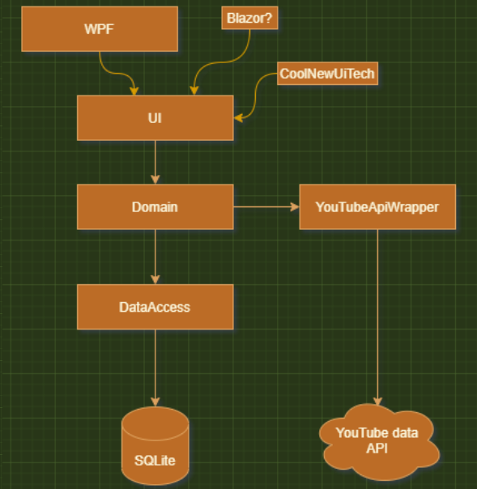

# Architecture of YouTube playlist manager

# Overview

YouTube playlist manager is a tool written to locally store and manage your personal YouTube playlists.

It allows for fast search of your videos, and fast scroll through thousands of videos in a 
playlist (rather than waiting every 100 videos for the 'next page' on YouTube)

## Project interaction overview

[Online Version](https://drive.google.com/file/d/1Y8-YgVYh6b51JDk2_0UtjnZOPK1W6jbq/view?usp=sharing)

## Development guidelines

The domain project has as little dependencies as possible.

Everything in the domain project should be using its own Entities, not Entities from other places - the most obvious example of this is the YouTube Data Api Video object vs our own VideoData object.

Where possible, most of the logic should be in the domain project - so it can be shared across multiple UIs. Interfaces for classes we interact with from the other projects should live in the domain project - as long as it doesn't pull in more dependencies.

Initially, when implementing view logic in the UI, the code will go in the UI project.

Over time however, the ViewModel type logic should move from UI project -> Domain project so that code is as shared as possible, and what's left in the UI projects are UI-specific code only.

## Building

Build in visual studio.

## Deploying

Run the app

## Prerequisites that can't be automated

- Setting up the application in google's development console
- Getting an API key + downloading client.json
- Pointing the UI to the API key and client.json

## Future architecture

- Build/deploy via GitHub actions
- Another C# UI framework reusing the same logic
- Porting the project to other languages

___

### Refererences used to help write this:

- https://en.wikipedia.org/wiki/4%2B1_architectural_view_model
- https://blog.cleancoder.com/uncle-bob/2012/08/13/the-clean-architecture.html
- https://matklad.github.io/2021/02/06/ARCHITECTURE.md.html
- https://github.com/rust-analyzer/rust-analyzer/blob/d7c99931d05e3723d878bea5dc26766791fa4e69/docs/dev/architecture.md
